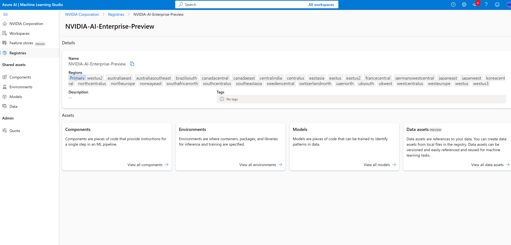

# NVIDIA AI Enterprise AzureML Registry (Private Preview)

The [contents](#nvidia-ai-enterprise-azureml-github-repository-contents-description) on this repository provide the Registry resources source code and [end-to-end application pipelines](#end-to-end-application-pipelines-showcased) implemented using the Resources contained in the [NVIDIA AI Enterprise AzureML Community Registry](https://ml.azure.com/registries/NVIDIA-AI-Enterprise-Preview) 

The Registry contains AzureML Resources that would enable Azure Machine Learning Users to set up end-to-end MLOPs workflows using NVIDIA AI Enterprise Software.

## Access to the Private Preview
The Registry is for now in private preview, to request access, please fill this [form](https://www.nvidia.com/en-us/data-center/solutions/mlops/?nvmid=reg-btn)

## NVIDIA AI Enterprise

NVIDIA AI Enterprise is an end-to-end platform for building accelerated production AI.

It includes a library of full-stack software including NVIDIA AI Workflows, frameworks, pretrained models and infrastructure optimization which streamline the development and deployment of production-ready applications for generative AI, speech AI, vision AI, cybersecurity, and more.
It is comprised of several sdk.

## Azure Machine Learning Resources

### Azure Machine Learning Registries
[Registries in Azure Machine Learning](https://techcommunity.microsoft.com/t5/ai-machine-learning-blog/announcing-registries-in-azure-machine-learning-to/ba-p/3649242)  are organization wide repositories of machine learning assets such as models, environments, and components. Registries provide a central platform for cataloging and operationalizing machine learning models across various personas, teams and environments involved in the machine learning lifecycle. 

### Azure Machine Learning Environments
[Azure Machine Learning Environments](https://learn.microsoft.com/en-us/azure/machine-learning/concept-environments?view=azureml-api-2) are an encapsulation of the environment that a piece of code requires to run inside Azure Machine Learning. The environments are managed and versioned entities that enable reproducible, auditable, and portable machine learning workflows across a variety of compute targets.

### AzureML Command Components
An [Azure Machine Learning Command Component](https://learn.microsoft.com/en-us/azure/machine-learning/concept-component?view=azureml-api-2) is a self-contained piece of code that does one step in a machine learning pipeline. A component is analogous to a function - it has a name, inputs, outputs, and a body. 

### AzureML Pipeline Components

They define entire workflows, by interconnecting the inputs and outputs of several command components

## Supported NVIDIA AI Enterprise Software

This private preview includes software from the following NVIDIA AI Enterprise SDKs

### TAO Toolkit

NVIDIA TAO Toolkit is low-code, AI model development toolkit that simplifies and accelerates the creation of custom production-ready models to power vision AI applications. The TAO Toolkit lets you use the power of transfer learning to fine-tune NVIDIA pretrained models with your own data and optimize for inference—without needing AI expertise. Developers can train and fine-tune State-of-the-art Vision Transformers (ViT) with TAO for object detection, image classification, segmentation, and other CV tasks. Now developers can easily train, deploy, and manage AI models at scale using NVIDIA TAO Toolkit with Azure ML. 

### RAPIDS

The NVIDIA RAPIDS™ suite of software libraries, gives you the freedom to execute end-to-end data science and analytics pipelines entirely on GPUs. It relies on NVIDIA® CUDA® primitives for low-level compute optimization but exposes that GPU parallelism and high-bandwidth memory speed through user-friendly Python interfaces.

### MONAI

MONAI is the domain-specific, open-source Medical AI framework that drives research breakthroughs and accelerates AI into clinical impact. MONAI unites doctors with data scientists to unlock the power of medical data to build deep learning models and deployable applications for medical AI workflows. MONAI provides the essential domain specific tools for data labeling, model training, and application deployment. With MONAI, it is easy to develop, reproduce and standardize on medical AI lifecycles.

### Triton

NVIDIA Triton™, an open-source inference serving software, standardizes AI model deployment and execution and delivers fast and scalable AI in production.

### DeepStream

DeepStream SDK is a complete streaming analytics toolkit based on GStreamer for AI-based multi-sensor processing, video, audio, and image understanding. It’s ideal for vision AI developers, software partners, startups, and OEMs building IVA apps and services. Developers can now create stream processing pipelines that incorporate neural networks and other complex processing tasks such as tracking, video encoding/decoding, and video rendering. DeepStream pipelines enable real-time analytics on video, image, and sensor data.

## NVIDIA AI Enterprise AzureML GitHub Repository Contents Description
The [NVIDIA AI Enterprise AzureML GitHub Repo](https://github.com/NVIDIA/NVIDIA_AI_Enterprise_AzureML/tree/main) has two types of documents contained into two main folders: src and samples

### src folder
Has the Azure Command Line Interface (CLI) 2.0 files used to publish the AzureML Resources into the NVIDIA AI Enterprise AzureML Registry

It is first indexed by AzureML Resource Type

* environments: Contains the files to produce all the Azure Machine Learning Environments published in the Registry
* components: Contains the files to produce all the Azure Machine Learning Command Components published in the Registry
* pipelines: Contains the files to produce all the Azure Machine Learning Pipeline Components published in the Registry
* data: Contains the files to publish Azure Machine Learning Datasets into the Registry that are used in the apps showcased in the samples folder 
* models: Contains the files to publish Azure Machine Learning Models into the Registry that are used in the apps showcased in the samples folder 

Each AzureML Resource Type is then organized by the NVIDIA AI Enterprise SDK the resources are based on

### samples folder

It contains examples of how to use the Azure Machine Learning Resources contained in the NVIDIA AI Enterprise AzureML Registry to implement end-to-end MLOPs workflows, from data acquisition to model endpoint deployment

#### Pre-requisites

* An Azure Machine Learning workspace. For more information, see [Create an Azure Machine Learning workspace](https://learn.microsoft.com/en-us/azure/machine-learning/how-to-manage-workspace?view=azureml-api-2&tabs=python)

* [Install the SDK v2](https://learn.microsoft.com/en-us/python/api/overview/azure/ai-ml-readme?view=azure-python) Users could use the optional scripts/install_libraries.sh script below

* [Install the Azure CLI and its extension for Machine Learning service (v2)](https://learn.microsoft.com/en-us/azure/machine-learning/how-to-configure-cli?view=azureml-api-2&tabs=public) Users could use the optional scripts/install_libraries.sh script below

* [Compute Target](https://learn.microsoft.com/en-us/azure/machine-learning/concept-compute-target?view=azureml-api-2) [quota](https://learn.microsoft.com/en-us/azure/quotas/quickstart-increase-quota-portal) for the [Azure VmSizes that support GPUs](https://learn.microsoft.com/en-us/azure/virtual-machines/sizes-gpu)

* A Compute Target, that supports GPUs. Here is [how to create a Compute Target.](https://learn.microsoft.com/en-us/azure/machine-learning/how-to-create-attach-compute-cluster?view=azureml-api-2) Users could use the optional script scripts/set_compute_cluster.sh script below

#### Subfolders
The folder has four subfolders:

* scripts: It provides auxiliary optional scripts to help users set up the context to run the material in the samples folder

    * To install the SDK v2 and the Azure CLI and its extension for Machine LEarning service, the user should run:
    
        **‘bash scripts/install_libs.sh’**
    
    * The user needs to provide its credentials: subscription_id, Azure Machine Learning Workspace and the Azure Resource Group the workspace belongs to, in the config file located at: scripts/config_files/config.sh

    Then the user could login into the CLI by running:

        **‘bash scripts/set_credentials.sh’**

* compute: The applications contained in the folder are run as Azure Machine Learning Jobs inside the Azure Machine Leaning Studio, jobs are executed by an Azure Machine Learning Compute Cluster, this folder provides optional mechanisms for user to set up Azure Machine Learning clusters that support NVIDIA GPUs

* cli: Contains applications that are launched using the Azure Machine Learning Command Line Interface

* python: Contains applications that are launched using the Azure Machine Learning Python Interface over a Jupyter Notebook

### End-to-end application pipelines showcased

* [TAO Street Object Detection Pipeline:](https://github.com/NVIDIA/NVIDIA_AI_Enterprise_AzureML/tree/main/samples/cli/tao/object_detection/detectnet_v2) Object detection is a popular computer vision technique that can detect one or multiple objects in a frame and place bounding boxes around them. This sample pipeline provided here, contains a ResNet18 model that you can retrain on an AzureML Compute Cluster, to identify a new set of objects: Car,Cyclist and Pedestrian, simply by running this pipeline.

* [TAO Face Detection Pipeline:](https://github.com/NVIDIA/NVIDIA_AI_Enterprise_AzureML/tree/main/samples/cli/tao/object_detection/facenet) This pipeline detects one or more faces in a given image or video. Compared to the FaceirNet model, this model gives better results with RGB images and smaller faces. The model is based on the NVIDIA DetectNet_v2 detector with ResNet18 as a feature extractor. This architecture, also known as GridBox object detection, uses bounding-box regression on a uniform grid on the input image.

* [RAPIDS NYC Taxi Data Regression Pipeline:](https://github.com/NVIDIA/NVIDIA_AI_Enterprise_AzureML/tree/main/samples/cli/RAPIDS/NYC_taxi_with_regression) This is an end-to-end machine learning pipeline which runs a linear regression to predict taxi fares in NYC, using RAPIDS CUDF and CUML Libraries

* [RAPIDS XGBoost Hyper Parameter Optimization pipeline:](https://github.com/NVIDIA/NVIDIA_AI_Enterprise_AzureML/tree/main/samples/cli/RAPIDS/HPO_with_XGBoost) In this pipeline a Hyper Paramater Optimization technique is used to optimize the parameters of an XGBoost Model

* [MONAI Brain tumor 3D image segmentation pipeline:](https://github.com/NVIDIA/NVIDIA_AI_Enterprise_AzureML/tree/main/samples/cli/3D-image_segmentation/monai) This pipeline is based on the [MONAI 3d brain tumor segmentation tutorial](https://github.com/Project-MONAI/tutorials/blob/main/3d_segmentation/swin_unetr_brats21_segmentation_3d.ipynb) and shows how to construct a training workflow of multi-labels segmentation task.

* [MONAI 3D segmentation Notebook:](https://github.com/NVIDIA/NVIDIA_AI_Enterprise_AzureML/tree/main/samples/python/3D-image-segmentation/monai) In this notebook, the user will run a sample of MONAI machine learning pipeline in Azure ML
it is based on the following MONAI tutorial: https://github.com/Project-MONAI/tutorials/blob/main/3d_segmentation/brats_segmentation_3d.ipynb

* [Deepstream Inference Pipeline](https://github.com/NVIDIA/NVIDIA_AI_Enterprise_AzureML/tree/main/samples/cli/DeepStream) In this pipeline a model from the Registry is deployed using the Deepstream Framework

