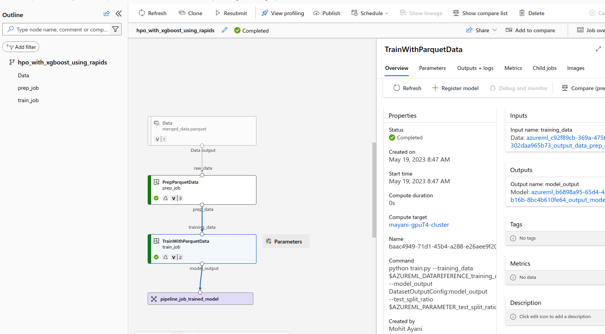

## Running XGBoost HPO pipeline

This steps in the README should be run only after you have registered all the components needed to run this pipeline

```
$ cd samples/cli/RAPIDS/HPO_with_XGBoost
$ bash run_pipeline.sh
```
You can now navigate to the the AzureML studio and should be able to see the following pipeline 

You will be also able to see the plot comparing `predicted v/s actual fares` 
 

