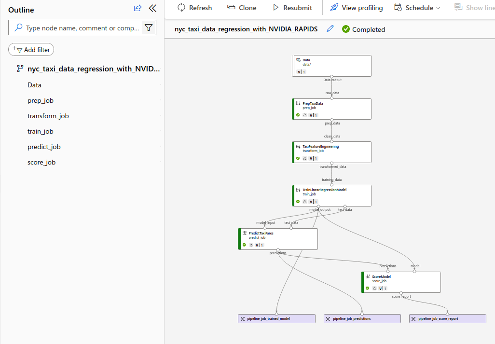

## Running pipeline

This example is referenced from the [AzureML-Examples](https://github.com/Azure/azureml-examples/tree/main/cli/jobs/pipelines-with-components/nyc_taxi_data_regression) page. We will be using NGC containers which leverage 
RAPIDS CUDF and CUML libraries for performing Regression.

The steps in this README should be run only when you have registered all the components and data. I have used the URLs of the registered components in the `yml` file. To run the pipeline
```
$ cd samples/cli/RAPIDS
$ bash run_pipeline.sh
```

You can now navigate to the AzureML studio and should be able to see the following 
