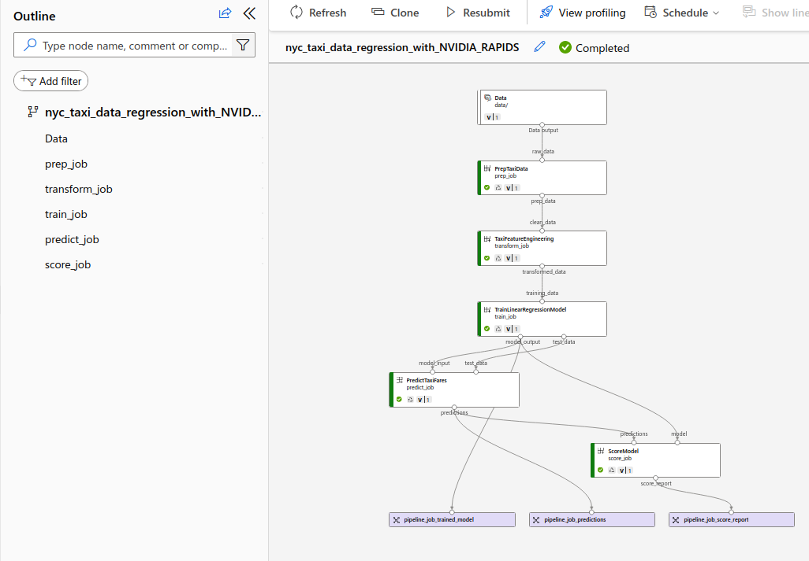

## Running pipeline

The steps in this README should be run only when you have registered all the components and data. I have used the URLs of the registered components in the `yml` file. To run the pipeline
```
$ cd nvaie/samples/cli/RAPIDS
$ bash run_pipeline.sh
```

You can now navigate to the AzureML studio and should be able to see the following 
