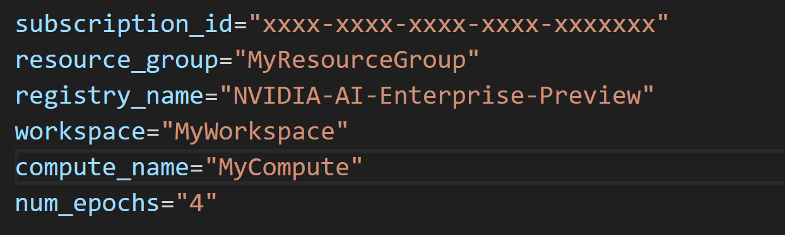

# Face Detect AzureML Pipeline using TAO DetectNet_v2 Components

This pipeline implements this [NGC Notebook](https://catalog.ngc.nvidia.com/orgs/nvidia/resources/facenet) 

## How to run the pipeline

The user should edit the config file in scripts/config_files/config.sh

To state its Azure subscription id, the Azure Machine Learning workspace, where the job would be executed, the Resource Group corresponding to the Workspace and the name of the Azure Machine Learning Compute Target under the Workspace to be used to execute the job  

Parameter num_epochs defines the number of epochs to be used while running the Train Component in the pipeline, in order to produce a model with production level performance, the user should use a value for num_epochs larger than 100, if so the user should expect the job to run for several hours. For demostration purposes the default value of 4 is appropiate

To set up its credentials, the user should run the following script:

<pre style="background-color:rgba(0, 0, 0, 0.0470588)">bash scripts/set_credentials.sh
</pre>

Then to submit the pipeline, the user should run the following script:
<pre style="background-color:rgba(0, 0, 0, 0.0470588)">bash scripts/run_pipeline.sh
</pre> 

## Face Detect Pipeline 

The FaceDetect model detects one or more faces in a given image or video. Compared to the FaceirNet model, this model gives better results with RGB images and smaller faces. The model is based on the NVIDIA DetectNet_v2 detector with ResNet18 as a feature extractor. This architecture, also known as GridBox object detection, uses bounding-box regression on a uniform grid on the input image. The gridbox system divides an input image into a grid that predicts four normalized bounding-box parameters (xc, yc, w, h) and a confidence value per output class. The raw normalized bounding-box and confidence detections need to be post-processed by a clustering algorithm such as DBSCAN or NMS to produce the final bounding-box coordinates and category labels.

The Pipeline yml executes this [Pipeline Component](https://github.com/NVIDIA/NVIDIA_AI_Enterprise_AzureML/tree/main/src/pipelines/tao/object_detection/facenet/tao_facenet_pipeline) 

Some of the major steps covered in the pipeline are, but not limited to: 

* Take a pretrained resnet18 model and train a ResNet-18 FaceNet model on the WIDERFACE dataset
* Prune the trained FaceNet model
* Retrain the pruned model to recover lost accuracy
* Export the pruned model
* Run Inference on the trained model
