# Object Detection AzureML Pipeline using TAO DetectNet_v2 Components

This pipeline implements this [NGC Notebook](https://catalog.ngc.nvidia.com/orgs/nvidia/resources/tao_detectnet) 

## Object Detection Pipeline 

Object detection is a popular computer vision technique that can detect one or multiple objects in a frame and place bounding boxes around them. This sample pipeline provided here, contains a ResNet18 model that you can retrain on an AzureML Compute Cluster, to identify a new set of objects: Car,Cyclist and Pedestrian, simply by running this pipeline.

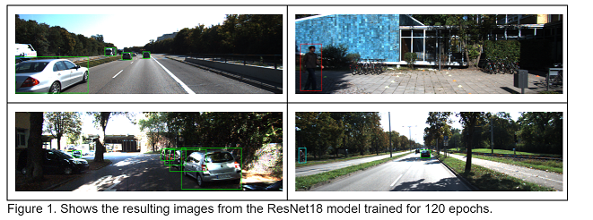

The Pipeline yml executes the Pipeline Component: 

<pre style="background-color:rgba(0, 0, 0, 0.0470588)">NVIDIA_AzureML_Components_and_Pipelines/components/tao/tfv3.22.05-tf1.15.4/object_detection/detectnet_v2/tao_detectnet_v2_pipeline
</pre>

Some of the major steps covered in the pipeline are, but not limited to: 

* Setting the environment variables
* Downloading and converting the training data
* Downloading the model from the NGC catalog
* Training the model
* Pruning the model – this removes the unwanted layers, reducing the size of the model
* Retraining the pruned model to recover the lost accuracy
* Quantize Aware Training (QAT) that changes the precision of the model to INT8, reducing the size of the model, without sacrificing accuracy
* Exporting the model for inference

Pipelines contain end-to-end user cases that produce a model or a set of models as output, each pipeline has a folder "scripts" that has the scripts the user needs to run to deploy the model(s) into an AzureML Inference Endpoint

Once the pipeline job has been succesfully completed, the user can now deploy the produced models by following the deployment instructions

This pipeline produces a model that is set up to be deployed as an AzureML Triton Inference Endpoint

## Populating the Deployment Config File

The information needed to do the deployment in stored in file: scripts/deployment_config.sh

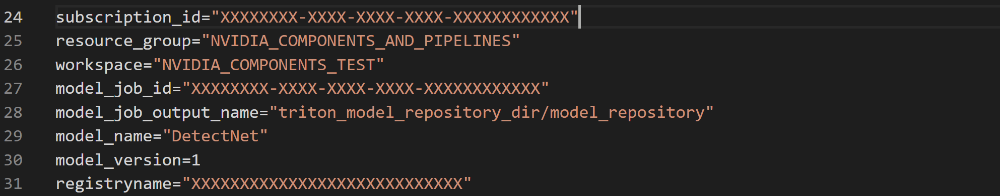

### Model Job Indentification

Variables model_job_id and model_job_output_name, identify the pipeline job associeated to the component that produced the model to be deployed, in this case of this pipeline that job is: "triton_create_model_repository", the Job ID and Output Name can be found from the Azure Portal

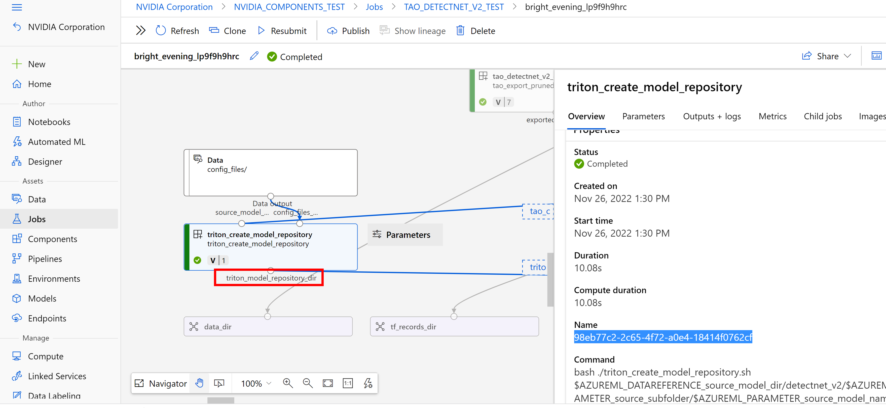

### Container Registry Identification
The user needs to provide variable "registryname" that corresponds to the container registry name for the Workspace provided, information that can be found on the Workspace properties page on the Azure Portal. 

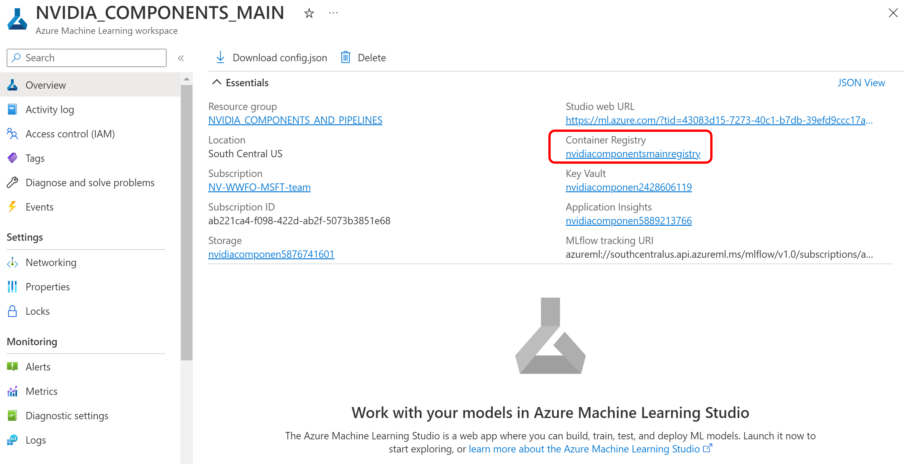

### Model Name and Version
Variables "model_name" and "model_version" correspond to the Model Name and Version the pipeline model would be registered under

## Deploying the Model

In this section, we’ll register the model and deploy it in AzureML with NVIDIA Triton Inference Server™, an open-source inference serving software that helps standardize model deployment and execution and delivers fast and scalable AI in production.
We’ll first register the model from the pipeline job that produced it, build and push the Triton container to the Azure Container Registry (ACR), create the inference endpoint and the model deployment

### Registering the Model

The model is registered by running:

<pre style="background-color:rgba(0, 0, 0, 0.0470588)">bash scripts/register_model.sh
</pre>

Once registered, the user should be able to verify the registration by clicking the "Model" tab under the workspace dashboard at the Azure Portal

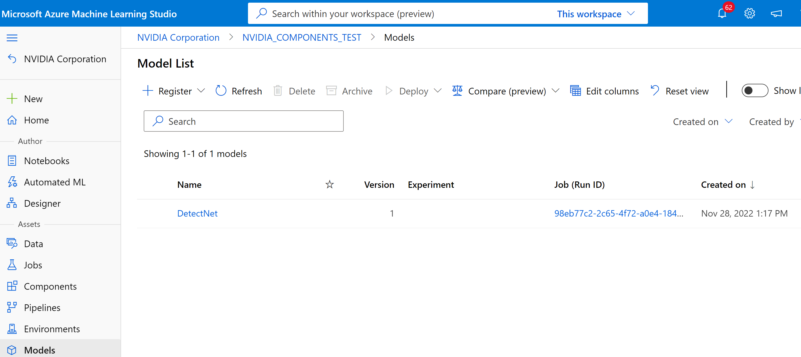

The user could further make sure the model is registered under the expected Triton model subfolder structure by clicking at the "Artifacts" tabs under the model dashboard

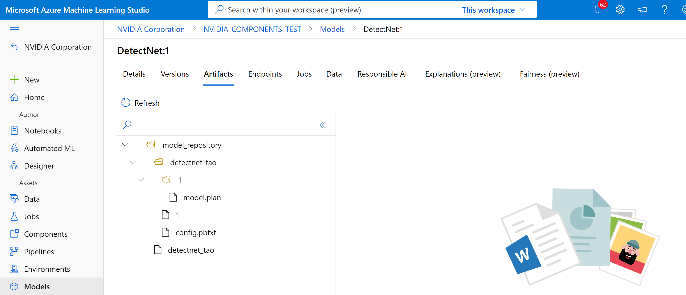

### Setting up Inference Libraries

The user sets the libraries needed in this section by running:
<pre style="background-color:rgba(0, 0, 0, 0.0470588)">bash scripts/set_inference_libraries.sh
</pre>

### Building the Triton Container Locally

Before uploading the container to be used for the deployment into the AzureML Container registry it need to be build locally first by running: 

<pre style="background-color:rgba(0, 0, 0, 0.0470588)">bash scripts/build_container.sh
</pre>

### Uploading docker image to the Azure Container Registry (ACR)

The docker image we just built needs to be pushed into the Azure Container Registry. To do this, the user needs to run the following script:

<pre style="background-color:rgba(0, 0, 0, 0.0470588)">bash scripts/push_container_to_ACR.sh
</pre>

The script tags the images and pushes it to the ACR by running command:

* docker push ${registryname}.azurecr.io/tao:latest	

Once the script completes, in the Azure Portal navigate to the provided ACR to see the container in the `tao` repository.

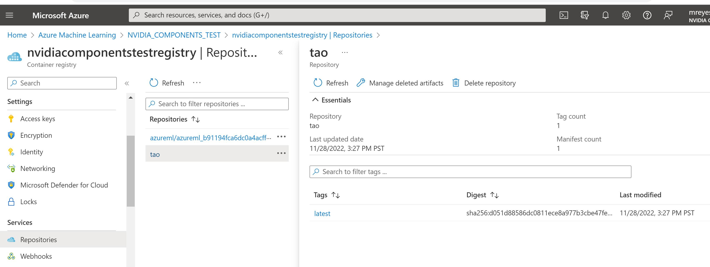

### Creating the Azure ML Endpoint and Deployment

The user should run the following script to create an Azure ML Endpoint followed by the deployment:

<pre style="background-color:rgba(0, 0, 0, 0.0470588)">bash scripts/create_endpoint_and_deployment.sh
</pre>

The script first creates the Azure ML Endpoint by running command:

* az ml online-endpoint create -f scripts/auxiliary_files/endpoint_aml.yml

File endpoint_aml.yml shown below contains the name of the Endpoint.

    $schema: https://Azure MLschemas.azureedge.net/latest/managedOnlineEndpoint.schema.json
    name: triton-tao-endpoint-aml-1
    auth_mode: key

The script then creates the deployment by running command:

* az ml online-deployment create -f scripts/auxiliary_files/deployment_aml.yml 

All the information needed to create the deployment is provided in file deployment_aml.yml. The file specifies the endpoint to use (triton-tao-endpoint-aml-1), the model uploaded on AML (DetectNet:1), the docker image uploaded to ACR (${registryname}.azurecr.io/tao:latest) and the name of the deployment: triton-tao-deployment-aml-1

The file also provides the VM Size to be used for the deployment (Standard_NC6s_v3), which should have the same nature of GPUs (V100) as the ones used by the pipeline. 

Once the script completes executing, you should be able to see the inference endpoint and the deployment information on the Azure Portal. 

The Endpoint information can be found by clicking on the "Endpoints" tab

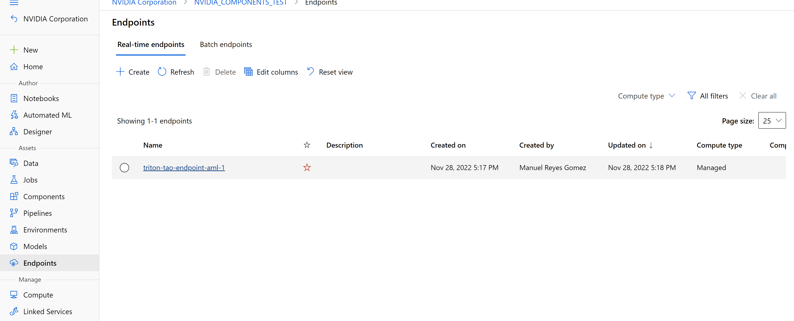

The deployment information can be found by clicking into the endpoint and navigating to the "Deployment Logs" Tab. There the user should be able to see the information of the model deployed

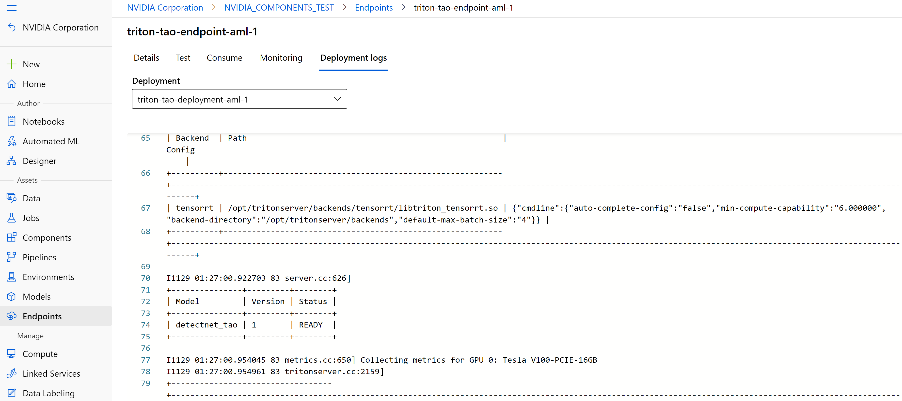

## Testing the Endpoint

You can use the endpoint by using the REST endpoint URL found on the "Consume" Tab of the endpoint information on the Azure Portal. The primary key is another important parameter you’ll need when querying the Endpoint.

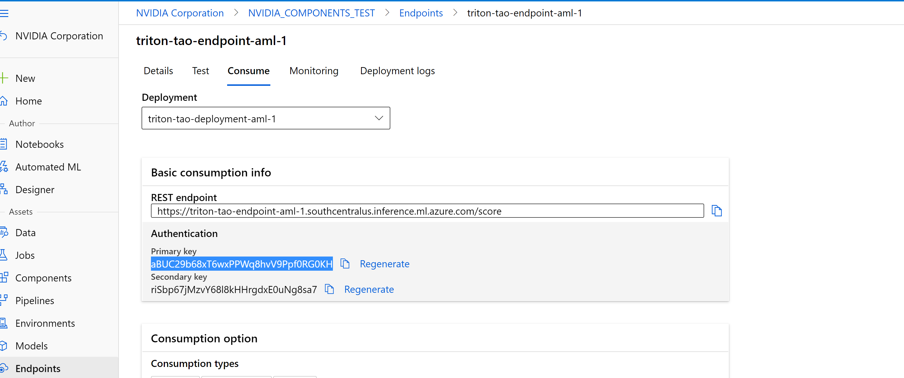

The REST endpoint URL (cliping the begining and the end) and the primary key (endpoint_token) should be entered into the scripts/config_files/endpoint_config.sh file.

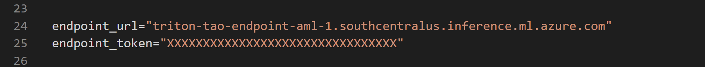
 
The user can query the endpoint by running:

<pre style="background-color:rgba(0, 0, 0, 0.0470588)">input=../scripts/ImageTest/Test.jpg
output=../scripts/ImageTest/Output
bash scripts/infer.sh $input $output
</pre>

In this case the input provided (../scripts/ImageTest/Test.jpg) is the following:

The output would be at: ../scripts/ImageTest/Output/infer_images/Test.jpg

 
