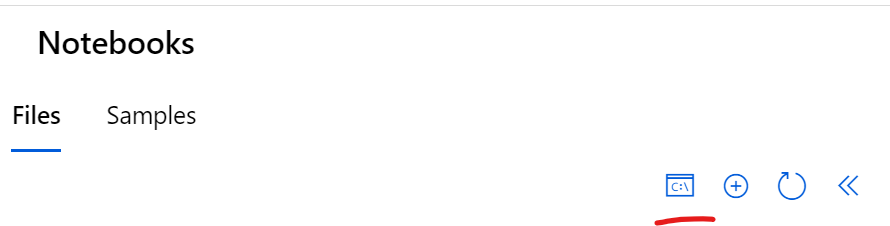
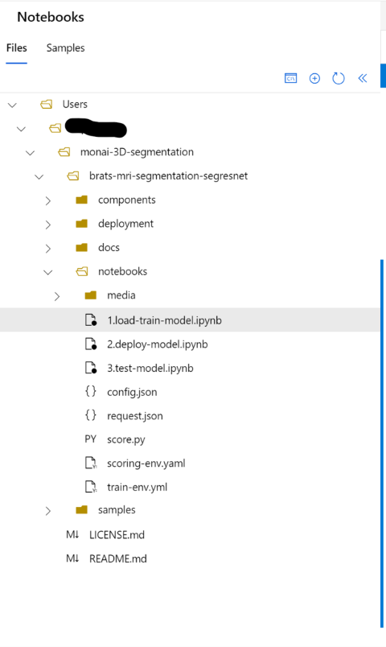
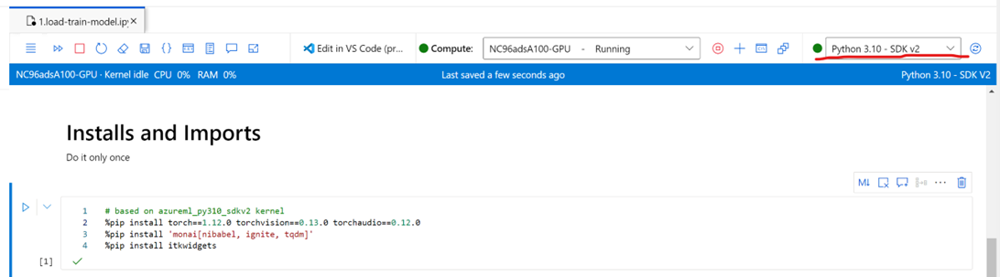
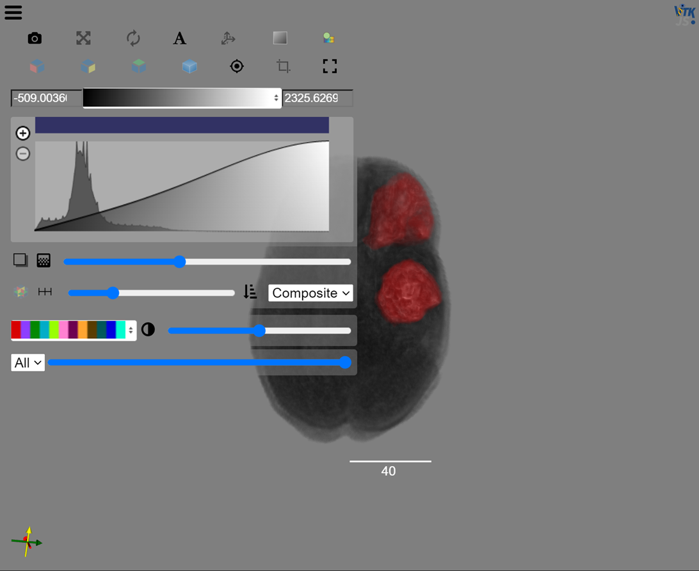
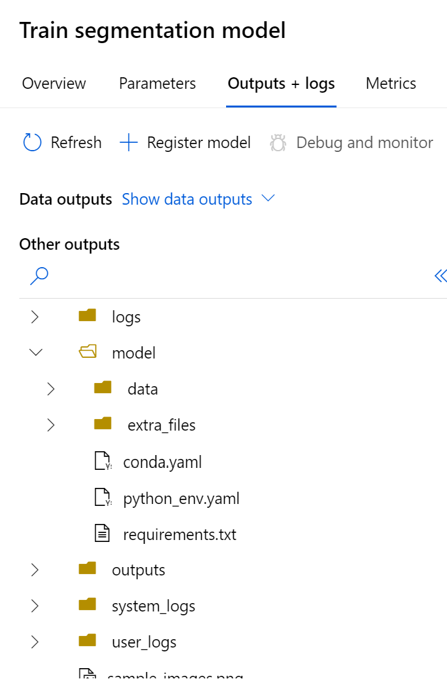
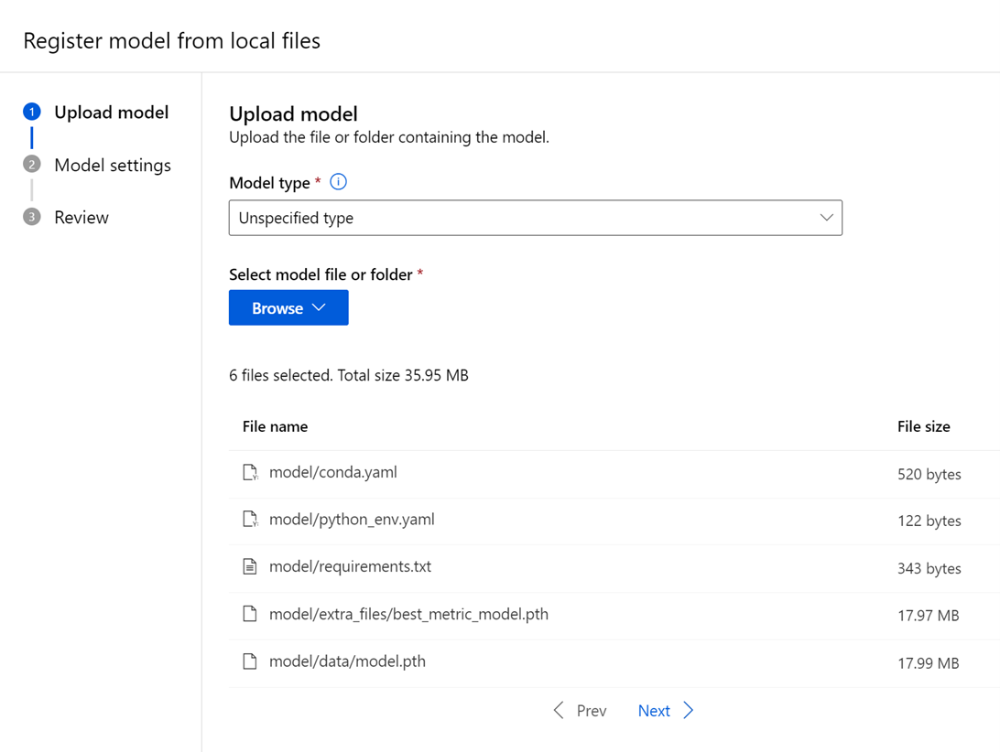
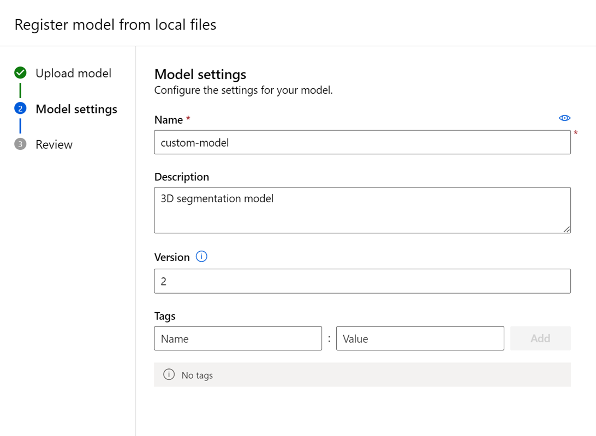
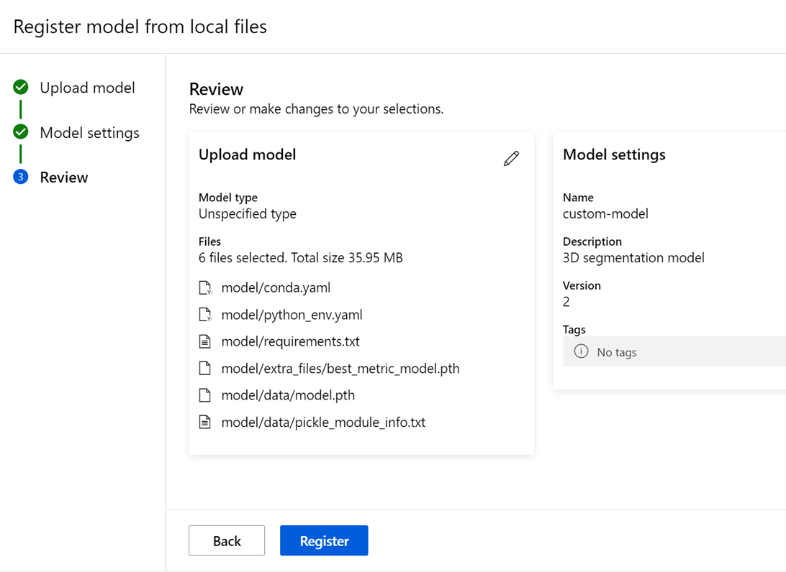
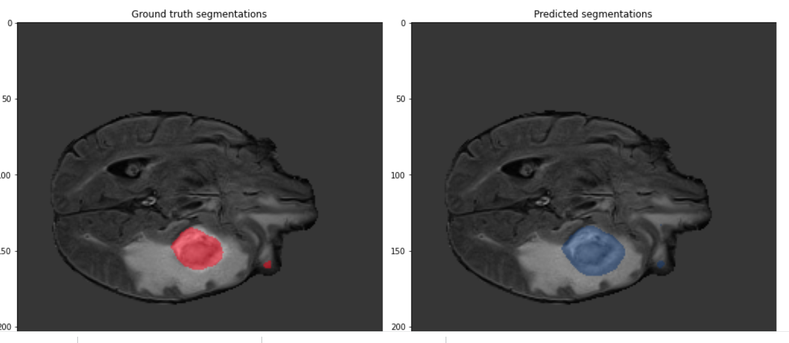

# Run MONAI Azure ML Tutorial

In this tutorial, you will:

* Provision a fully functional environment in your own Azure subscription
* Run a sample of MONAI machine learning pipeline in Azure ML

it is based on the following MONAI tutorial: https://github.com/Project-MONAI/tutorials/blob/main/3d_segmentation/brats_segmentation_3d.ipynb

## Prerequisites

To enjoy this quick deployment, you will need to:

* have an active [Azure subscription](https://azure.microsoft.com) that you can use for development purposes,
* have permissions to create resources, set permissions, and create identities in this subscription (or at least in one resource group),
  * Note that to set permissions, you typically need _Owner_ role in the subscription or resource group - _Contributor_ role is not enough. This is key for being able to _secure_ the setup.
* [install the Azure CLI](https://learn.microsoft.com/en-us/cli/azure/install-azure-cli).

## Deploy to Azure

1. Click on the button below. It will open in Azure Portal a page to deploy the resources in your subscription.

| Button | Description |
| :-- | :-- |
|  | This setup is intended only for demo purposes. The data is still accessible by the users of your subscription when opening the storage accounts, and data exfiltration is possible. |

> Notes:
>
> * If someone already provisioned a demo with the same name in your subscription, change **Demo Base Name** parameter to a unique value.
> * For provisioning GPU or CPU, you need just use a GPU/CPU SKU value for the "Compute SKU" parameter, `Standard_NC96ads_A100` for instance. An overview of the GPU SKU's available in Azure can be found [here](https://learn.microsoft.com/en-us/azure/virtual-machines/sizes-gpu). Beware though, SKU availability may vary depending on the region you choose, so you may have to use different Azure regions instead of the default ones.

2.  Once the automatic deployment is finished you can open new workspace
    and after that related Machine Learning Studio

3.  Next you need to create a compute instance to run tutorial
    notebooks. Click Compute icon in the vertical menu on the left. Next
    select Compute instances and [create
    one](https://learn.microsoft.com/en-us/azure/machine-learning/how-to-create-manage-compute-instance?view=azureml-api-2&tabs=azure-studio).

> **NOTES:**
>
> To run the current version of the tutorial (all steps) you need
> Standard_NC96ads_A100. For some notebook steps you can use smaller
> sizes.

4.  Make sure that automatically created **monai-cluster** is based on
    Standard_NC96ads_A100 too.

5.  Once you have your compute instance running. Click Notebooks and
    Terminal icon.

After that you need to clone the repository to have the latest code in
your workspace.

6.  Next you need to get data from
    [Kaggle](https://www.kaggle.com/datasets/dschettler8845/brats-2021-task1).
    In this tutorial we are using only BraTS2021_Training_Data.tar.

7.  You need to put the file in existing or new [Azure Blob
    Storage](https://learn.microsoft.com/en-us/azure/storage/blobs/storage-quickstart-blobs-portal)
    . To do it fast you can use
    [azcopy](https://learn.microsoft.com/en-us/azure/storage/common/storage-use-azcopy-blobs-upload)

8.  After you have data in a blob storage. You need to create [Azure ML
    data
    asset](https://learn.microsoft.com/en-us/azure/machine-learning/how-to-create-data-assets?view=azureml-api-2&tabs=Studio)
    (file type) using "From Azure storage" option.

## Running 1.load-train-model.ipynb 

1.  To run the tutorial, you need to go open the first notebook

2.  Make sure your compute instance is still running.

3.  Download config.json file to simplify MLClient creation. After
    downloading you need to upload it to notebooks folder (like on the
    previous image.

> **Loading and training**

1.  In the open 1.load-train-model notebook correct tar_location value
    using your data asset url

{width="6.5in"

2.  Make sure you select SDK v2 Python kernel .

>  generated" width="75%" />

3.  Start running the notebook step by step.

4.  The first step (on the previous image) will install required
    libraries on the compute instance.

5.  You don't need to run it again on the same compute instance.

> **Notebook steps definition**

In the notebook we are following MONAI tutorial and using Azure ML
components to run it. After installing required libraries and importing
them in the notebook we are setting names and references to existing
data (training dataset from AzureML workspace data asset and validation
and visualization samples from tutorial github.

Next, we are creating MLClient using default crepdentials and workspace
parameters from config json file. After that we convert the
multi-classes labels into multi-labels segmentation task and setup
transforms for training and validation.

In the next cell you can view the image. Currently it supported only
under VSCode. The image will look like this.

In the next section we are assigning Compute instance to MLClient. If we
already have it running it will just assign it or create a new one and
assign.

In the next step we are creating or just assigning previously created
Azure ML environment to run training pipeline. Yml specification of the
environment is in train-env.yml file under notebooks folder.

The notebook is based on Azure ML SDK 2. To demonstrate power of new
components and pipelines in the next steps we are loading upload and
train components created by related yml files in components folder.

After setting required parameters we are creating and submitting the
segmentation pipeline. After it finishes it will create the result model
like the one saved in ginthub.

> **NOTES:**
>
>You can run all cells. If for some reason it fails you could rerun
>failed steps or use Azure ML to fix problems. For example, if it fails
>during environment building you can rebuild it using Environments
>window.
>
>If some steps of the pipeline fail you can open Pipelines window and
>check logs for the whole pipeline or different steps/components. Just
>double-click failed step and Use Outputs + logs.
>
>By the way, the result model will be saved together with other outputs
>in model folder
>
>Make sure training environment name is matching environment name in .yaml
>file for used environment

## Running 2.deploy-model.ipynb notebook

As prerequisites you have to successfully finish
1.load-train-model.ipynb notebook.

1.  Using Azure ML UI register best trained model generated in outputs
    by 1.load-train-model.ipynb notebook. To do that select Model in
    Azure ML vertical menu and select "+Register" and "From local
    files".

2.  After that just follow the wizard

3.  Open 2.deploy-model.ipynb notebook and run all cells.

**Notebook steps definition**

Import required libraries. Create MLClient. Specify global variable.

Load previously registered model (latest version).

Create online End Point.

Create inference scoring environment based on scoring-env.yaml

Deploy the new Endpoint. This operation will take long time. Make sure
it is performed with specified timeout and using score.py

Assign 100% of Endpoint traffic to the notebook deployment.

> **NOTES:**
>
>Make sure Endpoint name is unique for the region

## Running 3.test-model.ipynb notebook

As prerequisites you have to successfully finish
1.load-train-model.ipynb and 2.deploy-model.ipynb notebooks.

The notebook logic is self-documentes. It sends a request to Azure ML Endpoint with trained model, 
gets and visualize a responce demonstrating good match with ground truth segmentation 

