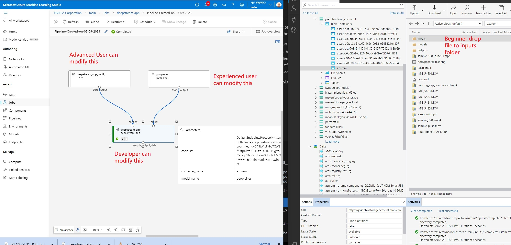
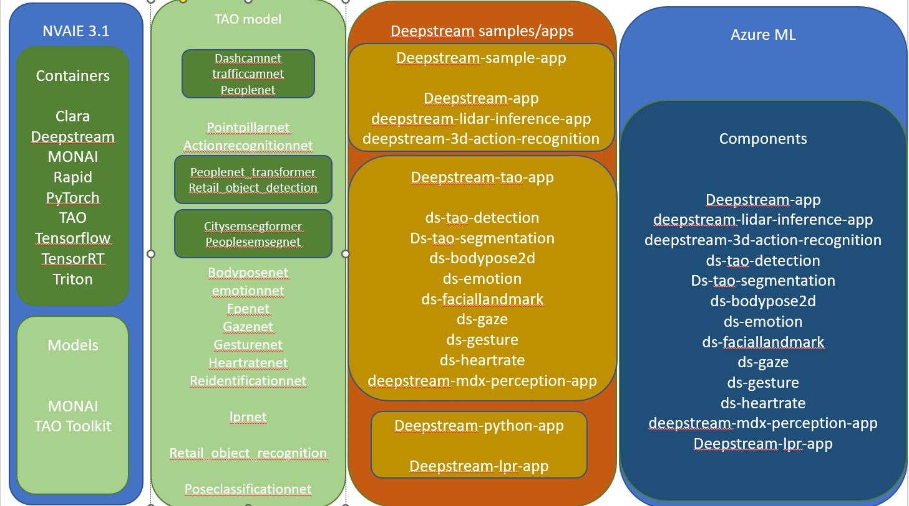

# DeepStream Components

NVidia AI Entriprise release a set of curated TAO models.  Deepstream has a lot of samples showing how to use them in several places. Deepstream Azure ML components wrap on top of those Deepstream samples/app.  Put them together and unify the interface to make them easy to use and easy to find.

### Usage scenario of Deepstream Azure component

* Beginner - use the provided models and configs to run the components.  All you need to do is drop the video in to the input queue and get the processed video in output queue
* Experienced user - You can use TAO to fine tune the model before use them with Deepstream to get better output performance.
* Advance user - You can modify the Deepstream config if you are expert of Deepstream SDK
* Developer user- You can study the component's source code and make some modification.  For example, sent the inference metadata to IoT Hub for further process, etc.

Following image shows the usage scenario of Deepstream Azure component

### Relationship between TAO model, deepstream app and Deepstream Azure component

The relationship between models and components are many to many.  Some models are used by several components and some components use several models.  Please follow indivisual link for more details.

* [bodypose 2d](./bodypose2d/README.md)

* [dashcamnet, trafficcamnet, vehiclemakenet, vehicletypenet, peopleNet](./deepstream-app/README.md)

* [peoplenet transformer, retail object detection](./ds-tao-detection/README.md)

* [people segmentation, city segmentation](./ds-tao-segmentation/README.md)

* [emotion](./emotion/README.md)
* [facial landmark](./faciallandmark/README.md)

* [gaze](./gaze/README.md)

* [gesture](./gesture/README.md)
* [license plate recognition](./lpr/README.md)

* [people re-identification, retail object recognition](./mdx-perception/README.md)

Following image shows the relationship between TAO model, deepstream app and Deepstream Azure component

## Deployment

Please make sure component, config and model are all registed

* component - src/register.sh
* config - register_config.sh
* model - register_model.sh

## Run

All components have same designer usage interface.

* drag and drop components to designer
* drag and drop corresponding model to designer and connect to component
* drag and drop corresponding config to designer and connect to component
* fill up the connection infomation in component's parameters
* deepstream-app, ds-tao-detection and dds-tao-segmentation can handle multiple models.  they have one more parameters for it.
* select computer and submit and wait for 10-40 minutes for initialization to start process video.
* To save the initialization time,  The component is designed to run forever and wait for video for process.  For development and testing, put any file with file name end with .end in inputs folder will break the loop.

Please reference indivisual README.md file for each component for more detail.  Links are provided in aboved section.
