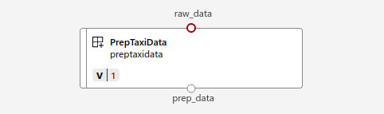

## Adding Preparing Data component

This component is used to prepare the data which will be then ingested by the Train component.

### Arguments to the component
The script `prep.py` which is being used by this component uses the following arguments
```
parser.add_argument("--raw_data", type=str, help="Path/URL to the Parquet file")
parser.add_argument("--prep_data",type=str, help="Path to the cleaned and filtered data")
```

#### Input arguments
 * The input data in parquet format. Since the parquet data is big to be uploaded on the repository, this data needs to be first uploaded on the `DataAssets` in the Registry, from where you can use the URL of the data path and refer in your `.yml` files

#### Output arguments
* The output data is the prepared data. This data is saved in csv format and is the one which will be ingested by the Training component. 

On the AzureML studio, you can see it as following 