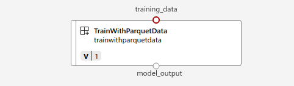

## Adding train_component

This component is used to run the training and outputs the XGBoost model.

### Arguments to the component

The script `train.py` which is being used by this component uses the following arguments

```
parser.add_argument("--training_data", type=str, help="Path to training data")
parser.add_argument("--model_output", type=str, help="Path to output model")
parser.add_argument("--test_split_ratio", type=float, help="ratio of train test split")
```

#### Input arguments
* `--training_data`: This is the cleaned data which you obtained from the `prep_data_component` and is used to train the model
* `--test_split_ratio`: This the float number which can be ranging from 0 to 1. This parameter specifies the ratio in which you have to split your Training data. The default value is set to 0.2 in the script and you can override it

#### Output arguments
* `--model_output`: This is the output model which is generated at the end of training. The output model is in the mlflow format.

On the AzureML studio, it looks like the following
