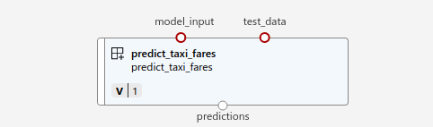

## Adding Predict component

This component uses the trained model to make predictions using the test data. The output are the predictions. 

### Arguments to the component

The script `predict.py` requires the following arguments
```
parser.add_argument("--model_input", type=str, help="Path of input model")
parser.add_argument("--test_data", type=str, help="Path to test data")
parser.add_argument("--predictions", type=str, help="Path of predictions")
```

#### Input arguments
* `model_input`: This is the path of the trained model folder. The model is in the mlflow format
* `test_data`: This is the path to the test data folder. 

#### Output arguments
* `predictions`: This is the output `csv` file which would be generated by this component. The output `csv` file is stored in the folder path specified in the `yml` files

On the AzureML studio, it looks like following


This component is used to run the training and outputs the XGBoost model.
The code in this folder are going to be used to register Prediction component on AzureML registry