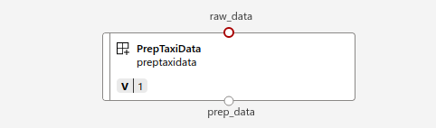

## Adding Prep component

This component is used to prepare the input data from its initial raw format to the one which would be ingested by Transform component

### Arguments to the component

```
parser.add_argument("--raw_data", type=str, help="Path to raw data")
parser.add_argument("--prep_data", type=str, help="Path of prepped data")
```

#### Input arguments
* `raw_data`: This input arguments points to the directory which contains the `csv` files for the input data.

#### Output arguments
* `prep_data`: This output arguments points to the directory which will store the prepared data 

On the AzureML studio, this looks following

