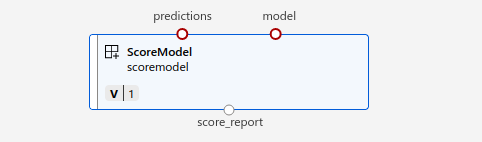

## Adding Score component

This component is used to calculate the scores (model coefficients, Mean squared error, Coefficient of determination) of trained model and the predictions it makes. 

### Arguments to the component

```
parser.add_argument("--predictions", type=str, help="Path of predictions and actual data")
parser.add_argument("--model", type=str, help="Path to model")
parser.add_argument("--score_report", type=str, help="Path to score report")
```

#### Input arguments
* `predictions`: This input arguments points to the directory which contains the csv files with the predictions
* `model`: This input argument specifies the path to the model in mlflow format.

#### Output arguments
* `score_report`: This output arguments points to the directory where the score report is saved

On the AzureML studio, this looks following

