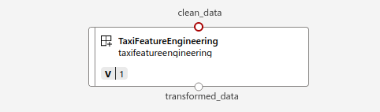

## Adding Transform component

This component is used to transform the prepped data. Columns in csv data which are not needed
gets dropped. Transformed data will then be ingested by the train component.

### Arguments to the component
The script `transform.py` which is being used by this component uses the following arguments
```
parser.add_argument("--clean_data", type=str, help="Path to prepped data")
parser.add_argument("--transformed_data", type=str, help="Path of output data")
```

#### Input arguments
 * The input data `(--clean_data)` is the path to the directory containing the cleaned data. This directory contains the prepped data in csv file format

#### Output arguments
* The output `(--transformed_data`) is the path where the directory containing the transformed data would be saved.

On the AzureML studio, you can see it as following 

