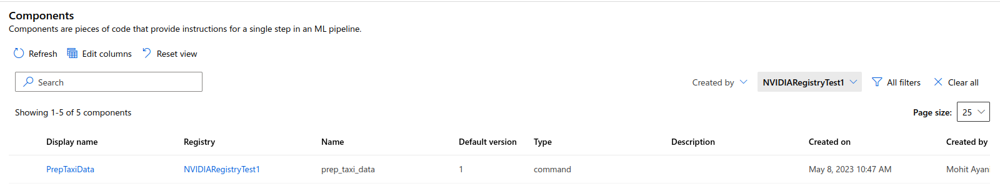

## Adding components to the Registry

The steps in this README needs to be done only once when you are registering your components on AzureML for the first time. Later you can just use the registered components in the AzureML

```
$ cd nvaie/src/components/RAPIDS
$ bash register_components.sh 
Uploading prep_src (0.0 MBs): 100%|█████████████████████████████████████████████████████████████████████████████████████████████████████████████████████████████████| 4161/4161 [00:00<00:00, 21676.78it/s]

Creating/updating registry component prep_taxi_data with version 1 ...Done (0m 13s)
{
  "$schema": "https://azuremlschemas.azureedge.net/latest/commandComponent.schema.json",
  "code": "azureml://registries/NVIDIARegistryTest1/codes/46f4
```

You can then navigate to the AzureML studio and should be able to find these registered components shown below

You can then click on this component name to get the following 

Similarly, you can run the steps for the other components present in this folder and register them