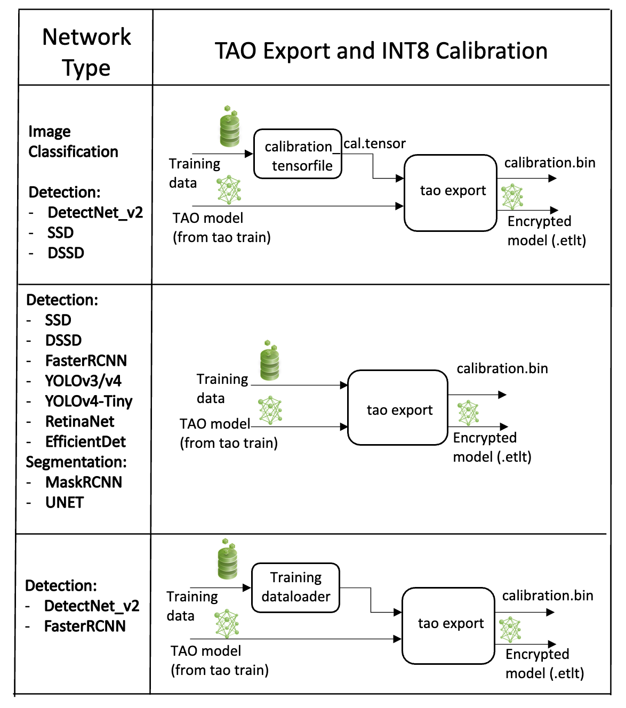

## [Exporting the Model](https://docs.nvidia.com/tao/tao-toolkit/text/object_detection/detectnet_v2.html#exporting-the-model)
#### This component is a wrapper for the TAO DetectNet_v2 export command

The DetectNet_V2 model application in the TAO Toolkit includes an export  sub-task to export and prepare a trained DetectNet_v2 model for Deploying to Triton or DeepStream. The export  sub-task optionally generates the calibration cache for TensorRT INT8 engine calibration.

Exporting the model decouples the training process from deployment and allows conversion to TensorRT engines outside the TAO environment. TensorRT engines are specific to each hardware configuration and should be generated for each unique inference environment. This may be interchangeably referred to as a .trt  or .engine  file. The same exported TAO model may be used universally across training and deployment hardware. This is referred to as the .etlt  file, or encrypted TAO file. During model export, the TAO model is encrypted with a private key, which is required when you deploy this model for inference.

### [INT8 Mode Overview](https://docs.nvidia.com/tao/tao-toolkit/text/object_detection/detectnet_v2.html#int8-mode-overview)
TensorRT engines can be generated in INT8 mode to run with lower precision, and thus improve performance. This process requires a cache file that contains scale factors for the tensors to help combat quantization errors, which may arise due to low-precision arithmetic. The calibration cache is generated using a calibration tensorfile when export is run with the --data_type flag set to int8. Pre-generating the calibration information and caching it removes the need for calibrating the model on the inference machine. Moving the calibration cache is usually much more convenient than moving the calibration tensorfile since it is a much smaller file and can be moved with the exported model. Using the calibration cache also speeds up engine creation as building the cache can take several minutes to generate depending on the size of the Tensorfile and the model itself.

The export tool can generate an INT8 calibration cache by ingesting training data using one of these options:

* Option 1: Providing a calibration tensorfile generated using the calibration_tensorfile task defined in DetectNet_v2. This command uses the data generators in the training pipeline to produce a drop of preprocessed batches of input images from the training dataset. Using this gives users the opportunity to maintain a record of the exact batches of the training data used to generate the calibration scale factors in the calibration cache file. However, this is a two-step process for generating an int8 cache file.

* Option 2: Pointing the tool to a directory of images that you want to use to calibrate the model. For this option, you will need to create a sub-sampled directory of random images that best represent your training dataset.

* Option 3: Using the training data loader directly to load the training images for INT8 calibration. This option is now the recommended approach as it helps to generate multiple random samples. This also ensures two important aspects of the data during calibration:

Data pre-processing in the INT8 calibration step is the same as in the training process.

The data batches are sampled randomly across the entire training dataset, thereby improving the accuracy of the int8 model.

Calibration occurs as a one-step process with the data batches being generated on the fly.

NVIDIA plans to eventually deprecate Option 1 and only support Options 2 and 3.

### [FP16/FP32 Model](https://docs.nvidia.com/tao/tao-toolkit/text/object_detection/detectnet_v2.html#fp16-fp32-model)

The calibration.bin  is only required if you need to run inference  at INT8 precision. For FP16/FP32 based inference, the export step is much simpler. All that is required is to provide a model from the train  step to export  to convert it into an encrypted TAO model.

### [Generating an INT8 tensorfile Using the calibration_tensorfile Command](https://docs.nvidia.com/tao/tao-toolkit/text/object_detection/detectnet_v2.html#generating-an-int8-tensorfile-using-the-calibration-tensorfile-command)

The INT8 tensorfile is a binary file that contains the preprocessed training samples, which may be used to calibrate the model. In this release, TAO Toolkit only supports calibration tensorfile generation for SSD, DSSD, DetectNet_v2, and classification models.

The sample usage for the calibration_tensorfile command to generate a calibration tensorfile is defined below:

<pre style="background-color:rgba(0, 0, 0, 0.0470588)">tao detectnet_v2 calibration_tensorfile [-h] -e < path to training experiment spec file>
                                             -o < path to output tensorfile>
                                             -m < maximum number of batches to serialize>
                                            [--use_validation_set]
</pre>

#### Required Arguments
* -e, --experiment_spec_file: The path to the experiment spec file (only required for SSD and FasterRCNN).

* -o, --output_path: The path to the output tensorfile that will be created.

* -m, --max_batches: The number of batches of input data to be serialized.

#### Optional Argument
* --use_validation_set: A flag specifying whether to use the validation dataset instead of the training set.

The following is a sample command to invoke the calibration_tensorfile command for a classification model:

<pre style="background-color:rgba(0, 0, 0, 0.0470588)">tao detectnet_v2 calibration_tensorfile
                  -e $SPECS_DIR/classification_retrain_spec.cfg
                  -m 10
                  -o $USER_EXPERIMENT_DIR/export/calibration.tensor
</pre>

### [Exporting the DetectNet_v2 Model](https://docs.nvidia.com/tao/tao-toolkit/text/object_detection/detectnet_v2.html#exporting-the-detectnet-v2-model)

The following are command line arguments of the export command:

<pre style="background-color:rgba(0, 0, 0, 0.0470588)">tao detectnet_v2 export [-h] -m <path to the .tlt model file generated by tao train>
                             -k < key>
                             [-o < path to output file>]
                             [--cal_data_file < path to tensor file>]
                             [--cal_image_dir < path to the directory images to calibrate the model]
                             [--cal_cache_file < path to output calibration file>]
                             [--data_type < Data type for the TensorRT backend during export>]
                             [--batches < Number of batches to calibrate over>]
                             [--max_batch_size < maximum trt batch size>]
                             [--max_workspace_size < maximum workspace size]
                             [--batch_size < batch size to TensorRT engine>]
                             [--experiment_spec < path to experiment spec file>]
                             [--engine_file < path to the TensorRT engine file>]
                             [--verbose Verbosity of the logger]
                             [--force_ptq Flag to force PTQ]
                             [--gen_ds_config Generate DeepStream config]
</pre>

#### Required Arguments
* -m, --model: The path to the .tlt model file to be exported using export.

* -k, --key: The key used to save the .tlt model file.

* -e, --experiment_spec: The path to the spec file. This argument is required for faster_rcnn, ssd, dssd, yolo, and retinanet.

#### Optional Arguments
* -o, --output_file: The path to save the exported model to. The default path is ./<input_file>.etlt.

* --data_type: The desired engine data type. The options are fp32, fp16, and int8. A calibration cache will be generated in int8 mode. The default value is fp32. If using int8 mode, the following INT8 arguments are required.

* -s, --strict_type_constraints: A Boolean flag to indicate whether or not to apply the TensorRT strict_type_constraints when building the TensorRT engine. Note this is only for applying the strict type of int8 mode.

* --gen_ds_config: A Boolean flag indicating whether to generate the template DeepStream related configuration (“nvinfer_config.txt”) as well as a label file (“labels.txt”) in the same directory as the output_file. Note that the config file is NOT a complete configuration file and requires the user to update the sample config files in DeepStream with the parameters generated.

### INT8 Export Mode Required Arguments
* --cal_data_file: The tensorfile generated from calibration_tensorfile for calibrating the engine. This can also be an output file if used with --cal_image_dir.

* --cal_image_dir: The directory of images to use for calibration.

### INT8 Export Optional Arguments
* --cal_cache_file: The path to save the calibration cache file to. The default value is ./cal.bin.

* --batches: The number of batches to use for calibration and inference testing. The default value is 10.

* --batch_size: The batch size to use for calibration. The default value is 8.

* --max_batch_size: The maximum batch size of the TensorRT engine. The default value is 16.

* --max_workspace_size: The maximum workspace size of the TensorRT engine. The default value is 1073741824 = 1<<30.

* --experiment_spec: The experiment_spec for training/inference/evaluation. This is used to generate the graphsurgeon config script for FasterRCNN from the experiment_spec (which is only useful for FasterRCNN). Use this argument when DetectNet_v2 and FasterRCNN also set up the dataloader-based calibrator to leverage the training dataloader to calibrate the model.

* --engine_file: The path to the serialized TensorRT engine file. Note that this file is hardware specific and cannot be generalized across GPUs. Use this argument to quickly test your model accuracy using TensorRT on the host. As the TensorRT engine file is hardware specific, you cannot use this engine file for deployment unless the deployment GPU is identical to the training GPU.

* --force_ptq: A Boolean flag to force post-training quantization on the exported .etlt model.

### Components Inputs and Outputs
* inputs
    * model_app_name
    * source_model_dir
    * source_subfolder
    * source_model_name
    * exported_subfolder
    * exported_model_name
    * key
    * engine_filename
    * cal_data_dir
    * cal_data_filename
    * use_image_cal
    * cal_image_dir
    * cal_cache_filename
    * experiment_specs_dir
    * experiment_specs_filename
    * data_type
    * strict_type_constraints
    * gen_ds_config
    * use_validation_set
    * batches
    * batch_size
    * max_batch_size
    * max_workspace_size
    * verbose
* outputs:
    * exported_model_dir

### Components Inputs and Outputs Mapping to TAO Command Parameters
* -m, --model: ${source_model_dir}/${model_app_name}/${source_subfolder}/${source_model_name}
* -k, --key: ${key}
* -e, --experiment_spec: ${experiment_specs_dir}/${experiment_specs_filename}
* -o, --output_file: ${exported_model_dir}/${model_app_name}/${exported_subfolder}/${exported_model_name}
* --data_type: ${data_type}
* -s, --strict_type_constraints: ${strict_type_constraints}
* --gen_ds_config: ${gen_ds_config}
* --cal_data_file: ${cal_data_dir}/${model_app_name}/${cal_data_filename}
* --cal_image_dir: ${cal_image_dir} 
* --cal_cache_file: ${cal_cache_filename} 
* --batches: ${batches} 
* --batch_size: ${batch_size} 
* --max_batch_size: ${max_batch_size} 
* --max_workspace_size: ${max_workspace_size} 
* --experiment_spec: ${experiment_specs_dir}/${experiment_specs_filename} 
* --engine_file: ${engine_filename} 
