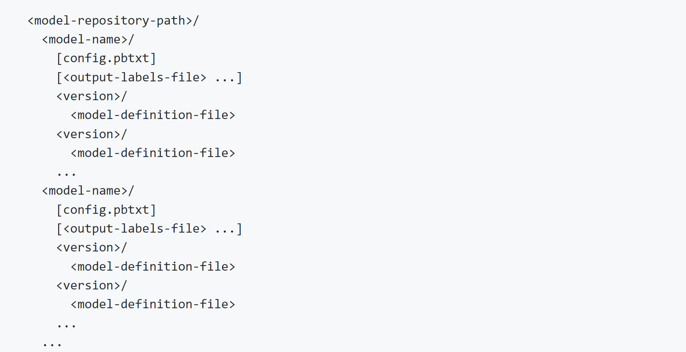

## Triton Create Model Repository Component

Triton requires the models to be deployed to use a particular [Model Repository](https://github.com/triton-inference-server/server/blob/main/docs/user_guide/model_repository.md) format

The model repositoy layout has the following form:

As it can be seen for a given model the following information is required:

* model-repository-path
* model-name
* configuration-file (config.pbtxt)
* model-definition-file

For a given model, this component creates a Model Repository format for the model to be deployed as an AzureML Triton Inference endpoint

In addition to the information above, the additional information is also required:

* model_source_path
* config_file_path 

### Component Inputs and Outputs

The component has the following inputs and outputs:

* inputs:
    * model_app_name
    * source_model_dir
    * source_subfolder
    * source_model_name
    * config_files_dir
    * config_filename
    * repository_model_name
    * model_filename
    * new_config_filename 
* outputs
    * triton_model_repository_dir:

### Components Inputs and Outputs Mapping
The mapping between the required information and the components inputs and outputs is the following:

* model_source_path: ${source_model_dir}/$/{source_subfolder}/${source_subfolder}
* config_file_path: ${config_files_dir}/${config_filename} 
* model-repository-path: ${triton_model_repository_dir}
* model-name: ${model_app_name}
* configuration-file (config.pbtxt): ${new_config_filename}
* model-definition-file: ${model_filename}
 
