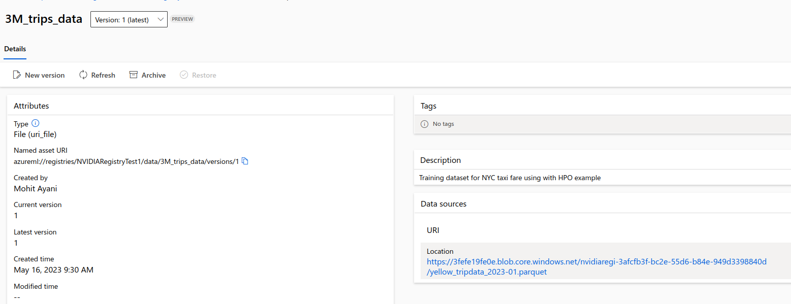

## Adding Data Assets to the Registry

The steps in this README needs to be done only once when you are registering your Data Assets on AzureML for the first time. Later you can just use these registered Data assets in your pipeline

The data assests used in this repository are for 2 pipelines: 
1. NYC Taxi Regression sample
2. Hyper Parameter Optimization (HPO) using XGBoost

### **Adding the csv data for Regression example**


```
$ export REGISTRY=<your registry name>
$ cd src/data/RAPIDS
$ bash register_dataassets.sh
```
### **Adding the Parquet Data for HPO example with XGBoost**
The parquet data (`merged_data.parquet`) used in below script can be downloaded from [here](https://drive.google.com/file/d/1ifmb6J7xDmeZ0_C2RJctHwv4pI3ssMtQ/view?usp=share_link)
. You need to run the script `register_parquet_data.sh` once the parquet data has been downloaded 
```
$ export REGISTRY=<your registry name>
$ bash register_parquet_data.sh
```

It will upload the Parquet file on the Data Assets as shown 
