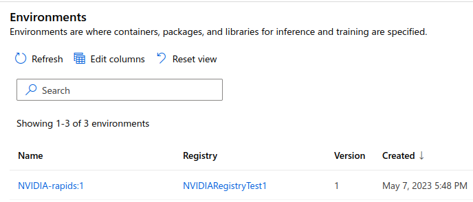

## Creating Envionment
The steps in this README needs to be done only once when you are registering your custom environment on AzureML for the first time. Later you can just use the Registered environment in the AzureML

```
$ cd nvaie/src/environments/RAPIDS
$ bash register_env.sh
Uploading env_rapids (0.0 MBs): 100%|██| 176/176 [00:00<00:00, 989.96it/s]
```
You can then head to the AzureML studio and see this environment created on the Registry as shown 